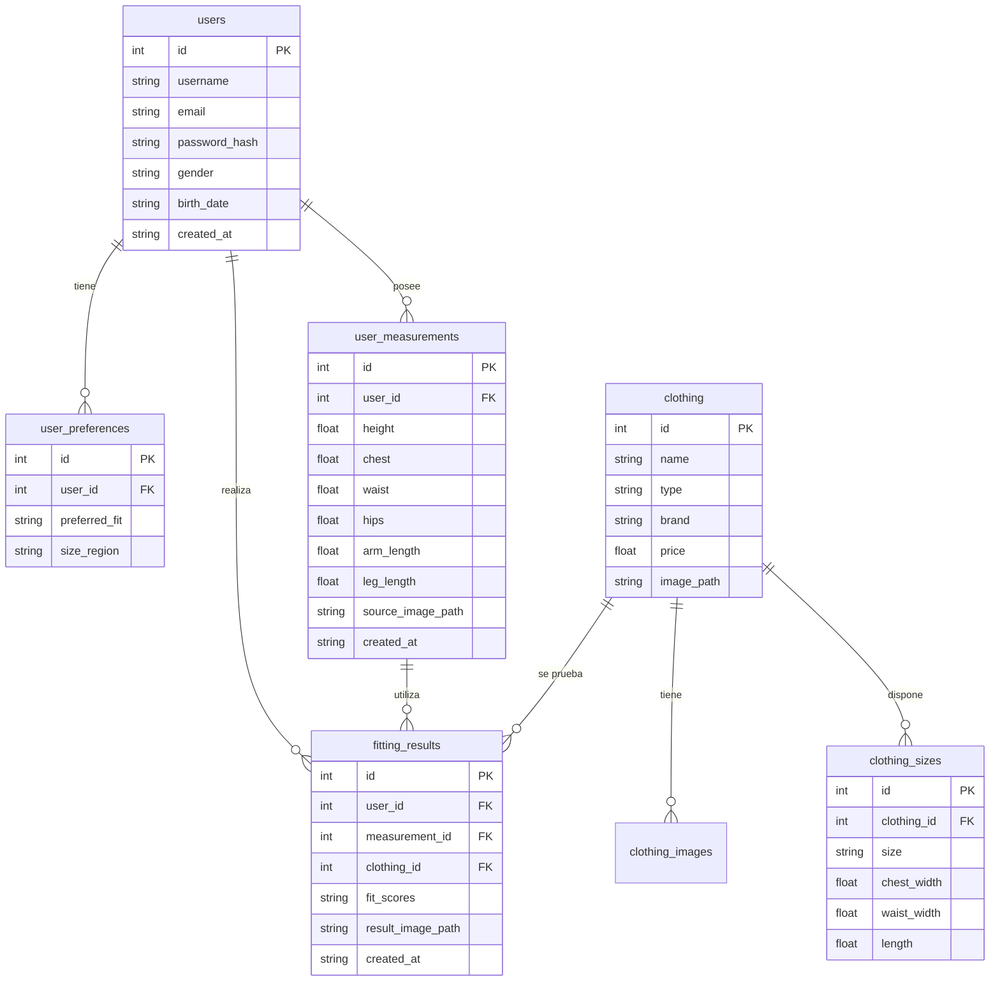

# Arquitectura del Sistema y Documentación de la API

Este documento detalla la arquitectura de software, los modelos de base de datos y la interfaz de programación de aplicaciones (API) del **Probador Virtual de Ropa**.

---

## 🏗️ Arquitectura General

El sistema sigue una arquitectura cliente-servidor monolítica ligera con soporte para un frontend de tipo SPA (Single Page Application).

* **Frontend**: Next.js 16 compilado de manera estática y servido por Flask.
* **Backend**: Flask (Python) encargado de la API de visión artificial, lógica de recomendación de tallas e interacción con la base de datos.
* **Base de Datos**: SQLite3 administrada mediante una clase de acceso directo multihilo segura (thread-safe).
* **Motor de Visión Artificial**: OpenCV y Google MediaPipe ejecutados en servidor para el cálculo en tiempo real de proporciones.

---

## 💾 Modelos y Esquema de Base de Datos

La base de datos se implementa en SQLite3. A continuación se explican las tablas principales definidas en `database/db.py`:



### Detalle de Tablas

1. **`users`**: Almacena credenciales básicas y perfiles de los usuarios.
2. **`user_preferences`**: Guarda preferencias personales como el tipo de corte deseado (`slim`, `regular`, `loose`) y región de tallaje preferida (`US`, `EU`, `UK`, `INT`).
3. **`brands`**: Catálogo de marcas registradas en el sistema.
4. **`size_charts`**: Tablas estáticas de tallas mundiales de referencia para marcas.
5. **`clothing`**: Catálogo de prendas disponibles para la prueba virtual (e.g. camisetas, pantalones).
6. **`clothing_images`**: Vistas y perspectivas de imágenes para las prendas.
7. **`clothing_sizes`**: Medidas físicas reales en centímetros para cada talla de una prenda (pecho, cintura, largo).
8. **`user_measurements`**: Historial de medidas anatómicas estimadas para cada usuario a partir de fotos o webcam.
9. **`fitting_results`**: Historial de simulaciones de ajuste con su respectiva puntuación.
10. **`size_recommendations`**: Recomendaciones específicas de tallas generadas para los usuarios.

---

## 🔌 Documentación de la API Flask

El backend Flask expone servicios Web tanto para renderizar plantillas dinámicas en Jinja2 como para la interacción JSON del frontend Next.js.

### 1. Endpoints de Medición y Visión Artificial

#### **Procesar Medición desde Webcam**
* **URL**: `/api/measure_webcam`
* **Método**: `POST`
* **Formato de Envío**: `multipart/form-data`
* **Parámetros**:
  - `image` (Archivo Binario): Imagen JPG/PNG capturada por la cámara web.
* **Respuesta de Éxito (JSON)**:
  ```json
  {
    "success": true,
    "measurement_id": 14,
    "measurements": {
      "height": 172.5,
      "chest": 94.2,
      "waist": 82.1,
      "hips": 96.8,
      "arm_length": 62.4,
      "leg_length": 101.0
    },
    "result_image": "static/results/measured_uuid_example.jpg"
  }
  ```
* **Respuesta de Error (JSON)**:
  ```json
  { "error": "No se detectó un cuerpo en la imagen" }
  ``` (Código HTTP 400)

---

### 2. Endpoints del Catálogo y Recomendación

#### **Obtener Catálogo de Prendas**
* **URL**: `/api/clothing`
* **Método**: `GET`
* **Respuesta (JSON)**:
  ```json
  [
    {
      "id": 1,
      "name": "Camiseta Deportiva FitVibe",
      "type": "shirt",
      "brand": "Generic",
      "price": 29.99,
      "imagePath": "/static/clothes/shirts/camisola_deporte.png",
      "sizes": ["S", "M", "L", "XL"]
    }
  ]
  ```

#### **Procesar Prueba Virtual e Inferencia de Ajuste**
* **URL**: `/api/fitting/results`
* **Método**: `POST`
* **Headers**: `Content-Type: application/json`
* **Cuerpo de la Petición**:
  ```json
  {
    "userId": 1,
    "clothingId": 1,
    "measurements": {
      "id": 14,
      "height": 172.5,
      "chest": 94.2,
      "waist": 82.1,
      "hips": 96.8
    }
  }
  ```
* **Respuesta (JSON)**:
  ```json
  {
    "previewImage": "/static/clothes/shirts/camisola_deporte.png",
    "recommendedSize": "M",
    "fitDescription": "Buen ajuste general.",
    "measurements": {
      "chest": {
        "user": 94.2,
        "garment": 96.2,
        "difference": 2.0
      }
    }
  }
  ```

---

### 3. Endpoints de Configuración y Utilidades

#### **Obtener Configuración del Sistema**
* **URL**: `/api/config`
* **Método**: `GET`
* **Respuesta (JSON)**: Retorna los parámetros cargados de `config.json` (resolución de cámara, factor de escala, etc.).

#### **Obtener Medición Reciente de Usuario**
* **URL**: `/api/measurements/user/<int:user_id>`
* **Método**: `GET`
* **Respuesta (JSON)**: Retorna el objeto de medidas más reciente para el ID de usuario especificado o un error 404 si no existen registros.

---

## 🧠 Lógica del Negocio (Módulos Core)

1. **`BodyDetector` (`core/body_detector.py`)**:
   Inicializa la API de detección de pose de MediaPipe. Recibe la imagen decodificada de OpenCV, ejecuta la inferencia en CPU/GPU y devuelve una matriz con las coordenadas normalizadas $(x, y, z)$ de los 33 landmarks anatómicos de la pose.

2. **`MeasurementCalculator` (`core/measurement.py`)**:
   Calcula la escala de píxeles a centímetros basándose en la altura de referencia establecida en `config.json` o la altura estimada por la distancia pupilar/coyunturas. Posteriormente, mide las distancias euclidianas 3D entre los landmarks para determinar los perímetros corporales aproximados del pecho, la cintura y las extremidades.

3. **`SizeRecommender` (`core/size_recommender.py`)**:
   Implementa un motor comparativo y clasificadores matemáticos simples para evaluar la holgura de la prenda. Compara el contorno del usuario contra el catálogo de tallas físicas de la prenda para sugerir la talla idónea y emitir la puntuación de ajuste (`fit_score`).
