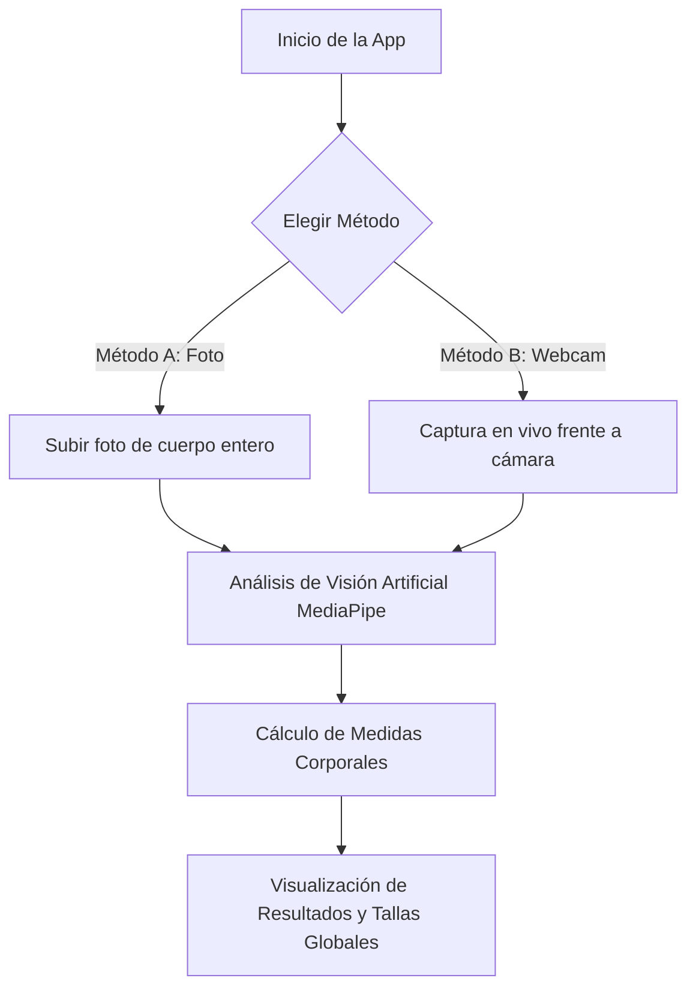

# Manual de Usuario y Guía de Operaciones

Esta guía proporciona instrucciones detalladas para utilizar e interactuar con la plataforma de **Probador Virtual de Ropa**, permitiendo a los usuarios obtener recomendaciones de tallas y visualizar cómo se adaptan las prendas virtuales a su anatomía.

---

## 🧭 Flujo General del Sistema

El sistema utiliza la cámara de tu dispositivo o imágenes de archivo para detectar las proporciones de tu cuerpo y compararlas de manera automática con las medidas de prendas comerciales.

---

## 📏 1. El Proceso de Medición y Captura

Para garantizar mediciones de alta precisión, dispones de dos modalidades:

### Método A: Subida de Imágenes (Foto)
1. En la página de inicio o en la sección **Medición**, selecciona la pestaña de **Subir Foto**.
2. Elige una foto tuya de cuerpo completo que cumpla con los siguientes criterios de calidad:
   - **Buena iluminación**: Evita sombras extremas o contraluz.
   - **Fondo neutro**: Un fondo de color uniforme ayuda a mejorar la precisión de la segmentación.
   - **Ropa ceñida**: El uso de ropa muy holgada durante la foto afectará la estimación real del contorno de tu pecho, cintura o cadera.
   - **Formatos permitidos**: `.JPG`, `.JPEG` o `.PNG`.
3. Haz clic en **Enviar**. El backend encriptará el archivo temporalmente bajo un `UUID` seguro, procesará la silueta y en menos de 2 segundos te redirigirá a los resultados.

### Método B: Captura en Vivo (Webcam)
1. Navega a la sección de **Medición vía Webcam**.
2. Otorga al navegador web los permisos necesarios para utilizar la cámara.
3. Ubícate a una distancia de **al menos 1.5 metros** de la cámara, asegurando que tu cuerpo completo (desde la cabeza hasta los tobillos) sea visible en el recuadro.
4. Mantén una postura erguida (brazos ligeramente separados del cuerpo) para que los algoritmos de detección localicen tus clavículas, hombros y caderas.
5. Haz clic en **Capturar Medida** para que el backend analice el fotograma.

---

## 📊 2. Visualización y Comprensión de Resultados

Una vez completada la detección, serás redirigido a la **Pantalla de Resultados**. Esta vista se compone de los siguientes bloques informativos:

### A. Silueta Analizada (Landmarks)
Se mostrará tu fotografía original superpuesta con un esqueleto virtual de colores. Los puntos y líneas de colores representan la geometría capturada por la IA para calcular tus hombros, tórax, cintura y largo de piernas en centímetros.

### B. Tu Talla en el Mundo (Equivalencias Globales)
A partir de tus medidas estimadas, el sistema busca coincidencias en diferentes estándares de tallaje internacionales. La pantalla muestra de forma comparativa tu talla en las siguientes regiones:
* **Estados Unidos (US)**
* **Europa (EU)**
* **Reino Unido (UK)**
* **Asia (ASIA)**
* **Latinoamérica (LATAM)**

*Ejemplo: Si tu contorno corporal equivale a una talla M en estándares estadounidenses, el sistema te mostrará que corresponde a una L/XL en Asia o a una 48/50 en Europa, ayudándote a tomar decisiones correctas al comprar ropa en tiendas en línea internacionales.*

### C. Puntuación de Ajuste (Fit Score)
El probador calcula qué tan bien se adapta la prenda elegida a tus proporciones y te dará un porcentaje de coincidencia (e.g., `Ajuste al 92%`).
* **Excelente (90% - 100%)**: La prenda te quedará muy cómoda y fiel a su talla de diseño.
* **Bueno (75% - 89%)**: La prenda te quedará bien, aunque puede sentirse ligeramente holgada o entallada en zonas específicas.
* **Aceptable (60% - 74%)**: La prenda es usable, pero podrías notar tensión en el pecho o excesiva soltura en la cintura.
* **No Recomendado (<60%)**: Se sugiere elegir una talla superior o inferior, ya que la actual no coincide con tus proporciones.

Adicionalmente, el recomendador te proporcionará sugerencias inteligentes (e.g., *"Elige una talla menor si prefieres un corte Slim Fit"*).
